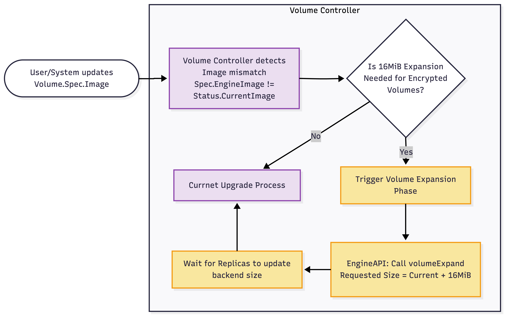

# LUKS2 Header Space Reservation for Encrypted Volumes

## Summary

This enhancement addresses an issue in which the actual block device size presented to the user is 16 MiB smaller than the requested volume size when encryption is enabled. The missing 16 MiB is currently consumed by the [LUKS2 encryption header](https://gitlab.com/cryptsetup/cryptsetup/-/wikis/FrequentlyAskedQuestions#10-luks2-questions). Although the LUKS2 header size is configurable, it is set to a fixed value in Longhorn. This proposal handles that overhead transparently at the backend layer, ensuring that users receive the exact usable capacity they requested while correctly managing the offset during volume rebuild, backup, restore, clone and expansion operations.

### Related Issues

- https://github.com/longhorn/longhorn/issues/9205

## Motivation

When users create a volume of a specific size, for example `10 GiB`, with encryption enabled, Longhorn currently reserves 16 MiB of that space for the LUKS2 metadata header. As a result, the `lsblk` output and the usable filesystem size inside the pod appear as `10 GiB - 16 MiB`. This discrepancy is confusing and can trigger strict size validation checks in some workloads or database applications.

### LUKS2 Header

The LUKS2 header is composed of three components: binary/metadata, Keyslot area, and alignment padding.

```ascii
+--------+--------+----------+---------+--------+----------+----------+
|Primary |First   | Secondary| Second  | KeySlot| Alignment| Encrypted|
|binary  |metadata| binary   | metadata| area   | padding  | data     |
|header  |        | header   |         |        |          |          |
+--------+--------+----------+---------+--------+----------+----------+
----------------------  LUKS2 Header  ----------------------           
```

- Header Size = (Primary Metadata) + (Secondary Metadata) + (Keyslot Area) + (Alignment Padding)

1. Keyslot Area:  
    By default, a key slot uses 4000 stripes, and each stripe consumes 64 bytes for the master key size. The total key slot space is exactly 8,000 KiB, or roughly 7.8 MiB.
2. Binary & JSON Metadata:  
    The binary header uses a fixed 4 KiB, and the default metadata allocation for standard use is 12 KiB. The total binary and metadata space is 32 KiB.
3. Alignment Padding:
    The alignment padding is used to align the encrypted data at the beginning of a block. Blocks are encrypted one by one, and a block is typically 512 bytes. This padding ensures that LUKS works correctly with encrypted sectors. `cryptsetup` pads the remaining ~8 MiB as empty space to ensure that the filesystem aligns properly with the SSD's hardware blocks.

- The version 2.1.0 is the exact minimal version of `cryptsetup` where the default LUKS2 header size became 16 MiB. (See [Cryptsetup 2.1.0 Release Notes](https://www.kernel.org/pub/linux/utils/cryptsetup/v2.1/v2.1.0-ReleaseNotes))

#### Parameters Affecting Header Size

During the `cryptsetup luksFormat` process, the following parameters dictate the final header size:

- `--type`  
  The Longhorn default value is `luks2`. If using the type `luks`, it will result in a 2 MiB header.
- `--luks2-metadata-size` and `--luks2-keyslots-size`  
    These allow you to explicitly define how much space to reserve for the JSON text and the binary keyslot data, overriding the defaults. Longhorn uses the default values  when the format command is executed.
- `--offset`  
    This explicitly forces the payload offset to a specific size. This parameter can be used to ensure that the header size remains fixed.

### Goals

- Abstract the 16 MiB LUKS2 header overhead from the user.
- Correctly propagate the calculated backend size (`Requested Size + 16 MiB`) through all operations.

### Non-goals

- Provide automatic, transparent migration for all existing encrypted volumes without the extra overhead during a Longhorn upgrade.
- Configurable LUKS2 header/overhead size.

## Proposal

Start the engine and replica processes using `Engine.Spec.VolumeSize` and `Replica.Spec.VolumeSize`, plus an additional 16 MiB if `Volume.Spec.Encrypted` is `true`.

### User Stories

Before this enhancement, if a user requests a `10 GiB` PersistentVolumeClaim (PVC) backed by an encrypted Longhorn volume, the actual block device presented to the pod in Kubernetes is `10 GiB - 16 MiB`. This occurs because Longhorn uses 16 MiB internally to store the LUKS2 metadata header. The discrepancy can cause application deployment workflows, such as those used by strict database systems, to fail if they perform hard validation on block device sizes.

After this enhancement, when a user requests a `10 GiB` encrypted volume, they receive exactly `10 GiB` of usable decrypted storage space in the pod. The 16 MiB overhead is automatically added as hidden backend replica capacity and is managed entirely by Longhorn.

### User Experience In Detail

From the end user's perspective, this functionality is fully transparent and requires no configuration changes.

1. A user creates a standard PVC with a storage class name that points to an encrypted Longhorn `StorageClass` and requests `1Gi` of storage (for example, by setting `spec.resources.requests.storage: 1Gi`).
2. Longhorn automatically creates a volume with `Size: 1073741824`, while internally adjusting the backend storage allocation to `1 GiB + 16 MiB`.
3. When the workload mounts the volume and the user runs `lsblk` or `df -h`, the reported partition size exactly matches `1G`, rather than the previous `1008M` equivalent.
4. Restoring a backup, taking a snapshot, and expanding a volume all respect this calculation implicitly. If the user expands the volume to `2 GiB`, the Longhorn UI and the Kubernetes PVC reflect `2 GiB`, while Longhorn automatically expands the encrypted backend replica to `2 GiB + 16 MiB`. Existing legacy volumes will retain their current size behavior by default and will only adopt the new size calculation if explicitly upgraded as described in the `Upgrade Plan`.

### API changes

N/A

## Design

### Implementation Overview

#### `longhorn-engine/pkg/meta/version.go`

```go
const (
    // CLIAPIVersion used to communicate with user e.g. longhorn-manager
    CLIAPIVersion    = 12
    CLIAPIMinVersion = 8
    ...
)
```

#### `go-common-libs/types/crypto.go`

Introduce helper utilities to centralize backend size calculation.

```go
const (
    CryptoKeyProvider = "CRYPTO_KEY_PROVIDER"
    CryptoKeyValue    = "CRYPTO_KEY_VALUE"
    ...
    LUKS2HeaderSize = 16 * 1024 * 1024 // 16 MiB
)

func getBackendSize(requestedVolumeSize int64, encrypted bool, cliAPIVersion int) int64 {
    // The default LUKS2 header size is 16 MiB, so it must be added to the replica size when the volume is encrypted. Otherwise, the device
    // presented to the user will be 16 MiB smaller than the requested size.
    // https://gitlab.com/cryptsetup/cryptsetup/-/wikis/FrequentlyAskedQuestions
    if encrypted && cliAPIVersion >= 12 {
        return requestedVolumeSize + LUKS2HeaderSize
    }
    return requestedVolumeSize
}
```

#### `engineapi/instance_manager.go`

Calculate the correct engine and replica size when creating the instance processes.

```go
type EngineInstanceCreateRequest struct {
    Engine    *longhorn.Engine
    Encrypted bool
    ...
}

type ReplicaInstanceCreateRequest struct {
    Replica   *longhorn.Replica
    Encrypted bool
    ...
}

// EngineInstanceCreate creates a new engine instance
func (c *InstanceManagerClient) EngineInstanceCreate(req *EngineInstanceCreateRequest) (*longhorn.InstanceProcess, error) {
    ...
    requestBackendSize := uint64(req.Engine.Spec.VolumeSize)
    case longhorn.DataEngineTypeV1:
        binary, args, err = getBinaryAndArgsForEngineProcessCreation(req.Replica, ..., req.Encrypted)
    case longhorn.DataEngineTypeV2:
        requestBackendSize = lhcrypto.getBackendSize(requestBackendSize, req.Encrypted, cliAPIVersion)
        ...
    
    instance, err := c.instanceServiceGrpcClient.InstanceCreate(&imclient.InstanceCreateRequest{
        ...
        Size:   requestBackendSize,
        Binary: binary,
    })
    ...
}

// ReplicaInstanceCreate creates a new replica instance
func (c *InstanceManagerClient) ReplicaInstanceCreate(req *ReplicaInstanceCreateRequest) (*longhorn.InstanceProcess, error) {
    ...
    if types.IsDataEngineV1(req.Replica.Spec.DataEngine) {
        binary, args = getBinaryAndArgsForReplicaProcessCreation(req.Replica, ..., req.Encrypted)
    }
    requestBackendSize := uint64(req.Replica.Spec.VolumeSize)
    if types.IsDataEngineV2(req.Replica.Spec.DataEngine) {
        requestBackendSize = lhcrypto.getBackendSize(requestBackendSize, req.Encrypted, cliAPIVersion)
        ...
    }
    ...
    instance, err := c.instanceServiceGrpcClient.InstanceCreate(&imclient.InstanceCreateRequest{
        ...
        Size:   requestBackendSize,
        Binary: binary,
    }
    ...
}
```

#### `engineapi/proxy_replica.go`

When performing replica add, rebuilding, or restoration, ensure that the replica proxy passes the correct volume size so that the correct amount of physical disk space is allocated.

```go
func (p *Proxy) ReplicaAdd(e *longhorn.Engine, replicaName, replicaAddress string, restore, fastSync bool, ...) (err error) {

    cliAPIVersion, err := ec.ds.GetDataEngineImageCLIAPIVersion(e.Spec.Image, e.Spec.DataEngine)
    volumeSize := lhcrypto.getBackendSize(e.Spec.VolumeSize, e.Spec.VolumeEncrypted, cliAPIVersion)
    volumeCurrentSize := lhcrypto.getBackendSize(e.Status.CurrentSize, e.Spec.VolumeEncrypted, cliAPIVersion)

    return p.grpcClient.ReplicaAdd(string(e.Spec.DataEngine), e.Name, e.Spec.VolumeName, p.DirectToURL(e),
        replicaName, replicaAddress, restore, volumeSize, volumeCurrentSize,
        int(replicaFileSyncHTTPClientTimeout), fastSync, localSync, grpcTimeoutSeconds)
}
```

### Affected Operations

#### Rebuilding

During rebuilding, the engine controller instructs the new replica to provision the correct size. Data synchronization reconstructs the target blocks, and because the underlying block device file accommodates `VolumeSize + 16 MiB`, the snapshot tree and raw sync can safely contain both the LUKS metadata and the encrypted payload.

For existing encrypted volumes using the old engine image, it will use `Replica.Spec.VolumeSize` as the current implementation without extra 16 MiB to rebuild a replica.

#### Backup and Restore

When a user restores from a backup, the user should set `Volume.Spec.Encrypted` appropriately for the restored volume, and the controller then provisions a new volume. The volume controller uses the `Volume.Spec.Encrypted` field to determine whether the backup originated from an encrypted volume, calculates the user-requested `Volume.Spec.Size`, and creates the engine and replica instance processes with the correct size.

#### Expanding

When a user expands an encrypted volume with the new engine image:

1. The volume expansion request is received and updates `Volume.Spec.Size`.
2. Check the `cryptsetup` version on the host before expanding the encrypted volume.
3. The volume controller updates `Engine.Spec.VolumeSize` and `Replica.Spec.VolumeSize` as `Volume.Spec.Size`.
4. The engine and replica controllers calculate the new `NewBackendSize = NewVolumeSize + 16 MiB` and start the expansion process with the correct backend size.

When a user expands an existing encrypted volume with the older engine image:

1. The volume expansion request is received and updates `Volume.Spec.Size`.
2. The volume controller updates `Engine.Spec.VolumeSize` and `Replica.Spec.VolumeSize` as `Volume.Spec.Size`.
3. The engine controller starts expanding process with `Engine.Spec.VolumeSize`.

`engineapi/proxy_volume.go`

```go
func (p *Proxy) VolumeExpand(e *longhorn.Engine) (err error) {
    v, err := p.ds.GetVolumeRO(e.Spec.VolumeName)
    cliAPIVersion, err := ec.ds.GetDataEngineImageCLIAPIVersion(e.Spec.Image, e.Spec.DataEngine)
    return p.grpcClient.VolumeExpand(string(e.Spec.DataEngine), e.Name, e.Spec.VolumeName, p.DirectToURL(e),
        lhcrypto.getBackendSize(e.Spec.VolumeSize, v.Spec.Encrypted, cliAPIVersion))
}
```

## Upgrade Plan

**Existing Encrypted Volumes:**  
Do not handle existing encrypted volumes until they are upgraded to the new engine image.

Newly Created Volume:

1. Increment the `CLIAPIVersion` by 1 to introduce a new API level that distinguishes existing encrypted volumes from newly created encrypted volumes.
2. When creating/rebuilding/expanding an encrypted volume with `CLIAPIVersion >= 12`, add the extra 16 MiB space to the engine and replicas.

Existing encrypted volumes:

1. For `CLIAPIVersion < 12`, follow the current implementation and do not add the extra 16 MiB until upgrading the engine.
2. During engine upgrade,
   1. Check the `cryptsetup` version on the host before expanding the encrypted volume.
   2. An implicit volume expansion will be triggered to make the backend size correct for encrypted volumes.
   3. Any error that occurs during the expansion process should return an error or create an event to record the error, and should not affect other volume operations.
3. After the upgrade, the replica image size on the host will be expanded to the volume size plus an extra 16 MiB, and the device size inside the workload will match the requested volume size.



## Test Plans

### New Volume Creation

- Create a `1 GiB` encrypted volume.
- Attach it to a pod and run `lsblk` or `fdisk -l` inside the pod.
- **Expected:** The block device shows exactly `1G`, `1073741824 bytes` (not `1008M`, `1056964608 bytes`).
- On the node to which the volume is attached, verify that the backend replica file size is exactly `1 GiB + 16 MiB`.

### Volume Expansion

1. Create a new `1 GiB` encrypted volume.
   - Expand the `1 GiB` encrypted volume to `2 GiB`.
   - Wait for expansion to complete.
   - **Expected:** `lsblk` or `fdisk -l` inside the pod shows `2G`. The replica image file on the worker node shows `2 GiB + 16 MiB`.
2. Use an existing `1 GiB` encrypted volume that uses the old engine image.
   - Expand the `1 GiB` encrypted volume to `2 GiB`.
   - Wait for expansion to complete.
   - **Expected:** `lsblk` or `fdisk -l` inside the pod shows `1.9G`. The replica image file on the worker node shows `2 GiB`.

### Replica Rebuild

1. Create a new `1 GiB` encrypted volume.
   - Delete a replica of the attached `1 GiB` encrypted volume.
   - Allow Longhorn to automatically rebuild the degraded replica.
   - **Expected:** Rebuild completes successfully. The new replica file size matches the existing replicas' `1 GiB + 16 MiB` size, and data integrity, for example the `md5sum` of a stored file, remains intact.
2. Use an existing `1 GiB` encrypted volume that uses the old engine image.
   - Delete a replica of the attached `1 GiB` encrypted volume.
   - Allow Longhorn to automatically rebuild the degraded replica.
   - **Expected:** Rebuild completes successfully. The new replica file size matches the existing replicas' `1 GiB` size, and data integrity, for example the `md5sum` of a stored file, remains intact.

### Backup Restore

- Create a `1 GiB` encrypted volume.
- Write a 100 MiB payload to the `1 GiB` encrypted volume and calculate payload checksum.
- Create a backup to the remote backup server.
- Restore the backup to a new volume with `Volume.Spec.Encrypted` true.
- Attach the restored volume to a workload.
- **Expected:** The restored volume presents exactly `1.0G` inside the workload. The restored payload checksum matches.
- Restore the backup to a new volume with `Volume.Spec.Encrypted` false.
- Attach the restored volume to a workload.
- **Expected:** The restored volume presents `1.0G - 16 MiB` inside the workload. The restored payload checksum matches.

### Engine upgrade

- Create a `1 GiB` encrypted volume using the old engine image.
- Check if the replica image file on the worker node shows `1 GiB` and the device size inside the workload is less than `1 GiB`.
- Write a 100 MiB payload to the `1 GiB` encrypted volume and calculate payload checksum.
- Upgrade the volume engine image to the new version.
- **Expected:** The replica image file on the worker node shows `1 GiB + 16 MiB`, the device size inside the workload is `1 GiB`, and the payload checksum matches.
